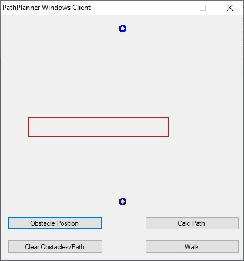

# Simple PathPlanner Algorithm in VC# and Python: #

**Developed by: Md. Sayed  Aktar Rahman**

**The PathPlannerProjectVCSharp-vs2005 is under:**
GPL and LGPL 3.0

**The PathPlanner-Python-VS2022 is under:**
Copyright (C) 2013 Riverbank Computing Limited.

Copyright (C) 2022 The Qt Company Ltd.

SPDX-License-Identifier: LicenseRef-Qt-Commercial OR BSD-3-Clause

The application gives the path within obstacles by pressing Calc Path Button. 

By pressing Walk the robot will start moving.

Robot can be stopped by pressing Stop.

User can clear obstacles/Path by pressing.

and by pressing Calc Path

and by pressing Walk and Stop.

After clearing. User can add obstacle by pressing Obstacle Position Button and giving left top and bottom right coordinates in percentages of  render area origin at left bottom.

and by pressing Calc Path and Walk.

